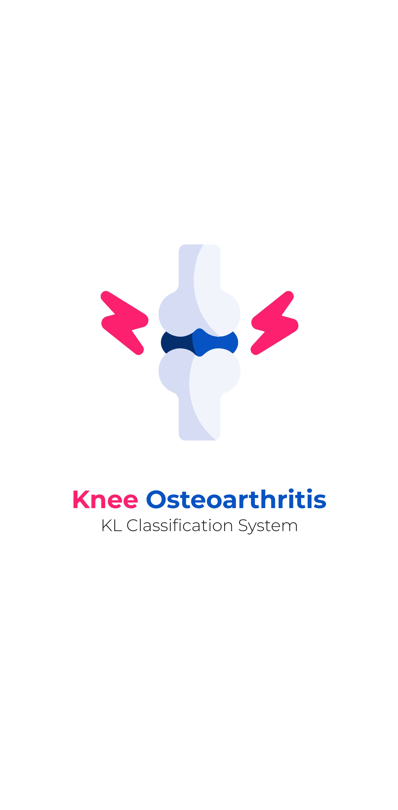
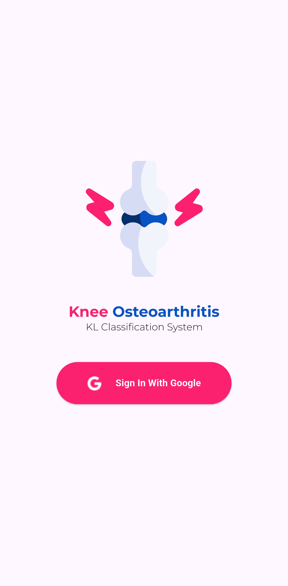
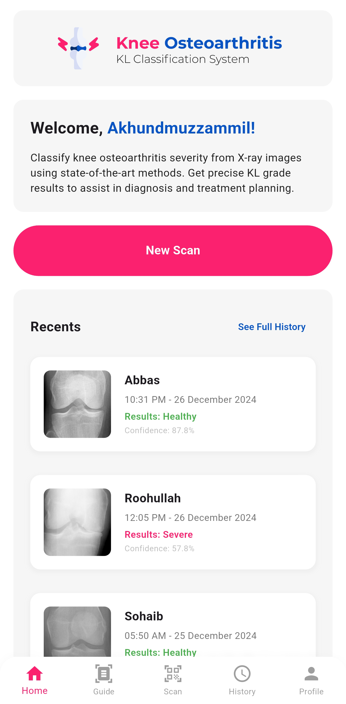
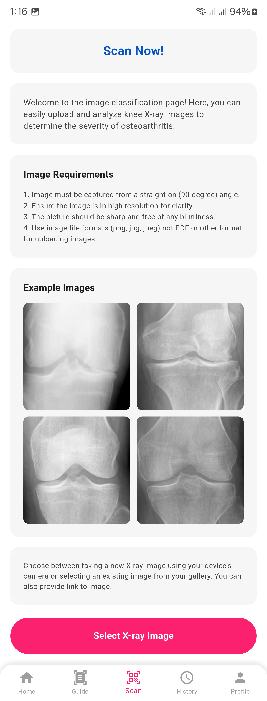
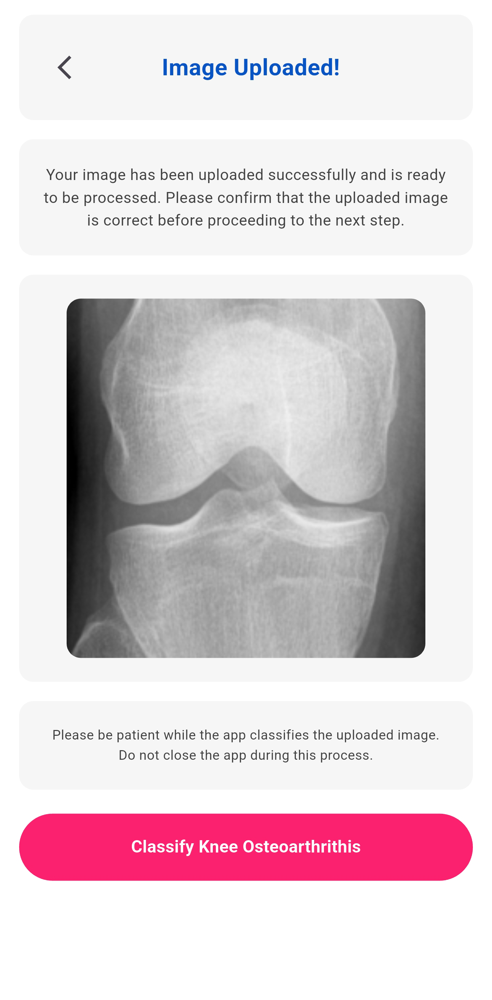
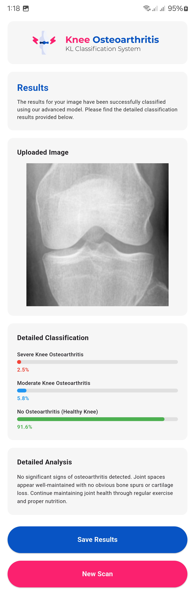
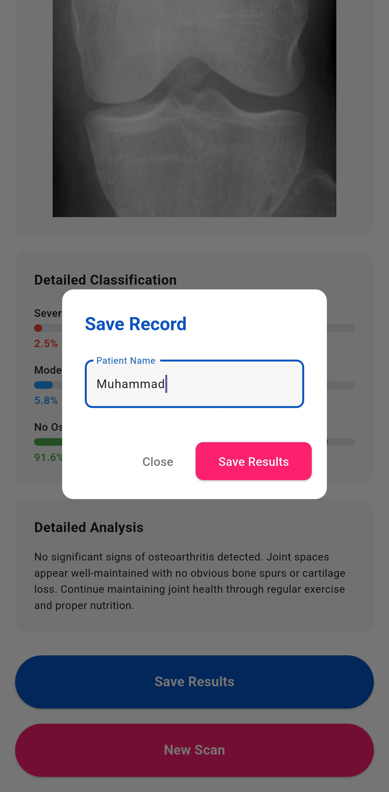
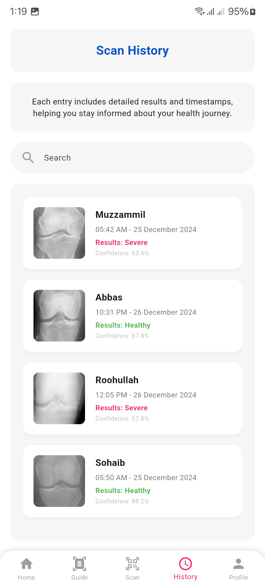
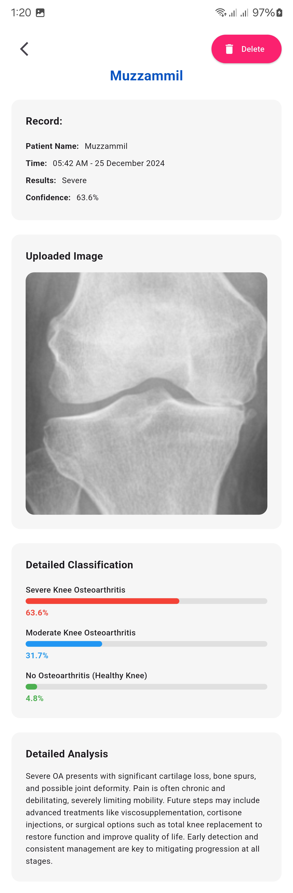

# KOA System: Flutter Android Application

The **KOA System Flutter Android Application** is a user-friendly mobile app designed to assist clinicians in automating the grading of knee osteoarthritis (OA) severity. The app simplifies the use of artificial intelligence in healthcare, providing real-time and accessible diagnostic tools on Android devices.

## Linked Repositories
- **[Main Repository](https://github.com/abdurrehman022/KOASystem)**: Machine Learning Model and Training for the KOA Classification System
- **[Flask API Repository](https://github.com/abdurrehman022/KOASystemAPI)**: Backend API implementation for the KOA Classification System

## Application Interface
View the application interface and results:

  
  
  
  
  
  

  
  
  
  
  
  

## Features

- **Real-Time Inference**: Upload X-ray images and instantly get predictions for OA severity categorized as **Healthy**, **Moderate**, or **Severe**.
- **Scan History**: Keeps a record of previous scans for easy access and tracking.
- **User Authentication**: Secure login using Google Authentication to ensure privacy and data protection.
- **Intuitive Design**: Designed with clinicians in mind, providing an easy-to-navigate interface built with Flutter.
- **Cloud-Based Integration**: All data processing is handled via a secure REST API hosted on AWS, ensuring fast and accurate results.
- **Cross-Platform Compatibility**: Although optimized for Android, the app can be adapted for iOS devices.

## Technology Stack

- **Frontend**: Flutter framework for a seamless and responsive mobile experience.
- **Backend Integration**: Communicates with a Flask-based REST API for processing and predictions.
- **Database**: Firebase for storing scan history and user-related data.
- **Authentication**: Google Authentication API for secure login and user management.

## Detailed App Workflow

1. **User Login**:
   - The app requires users to log in via Google Authentication.
   - Ensures personalized data handling and access to scan history.

2. **X-Ray Upload**:
   - Users can either upload images from their device gallery or take a new photo using the in-app camera feature.
   - A preview of the image is shown before submission to avoid errors.

3. **Inference and Results**:
   - Uploaded images are sent to the REST API for processing.
   - Results, including the OA severity category and confidence scores, are displayed in an easy-to-read format.

4. **Scan History**:
   - All scans are saved under the user's account in Firebase.
   - The history includes the date, time, and results for each scan, with an option to delete or revisit detailed reports.

5. **User Interface**:
   - Simple and elegant design with a focus on usability in clinical environments.
   - Key actions, such as "Upload Image" and "View History," are easily accessible from the main dashboard.

## Code Files

This repository does not include the source code for the Android application. To gain access to code files, contact us.

## Future Enhancements

- **Offline Mode**: Adding support for offline predictions using edge AI.
- **Expanded Scan History**: Advanced filtering and search capabilities for previous scans.
- **Enhanced Reports**: Providing detailed diagnostic reports and treatment suggestions.
- **iOS Support**: Extending the app's availability to iOS devices.
- **Multi-Language Support**: Adding translations to make the app accessible to non-English speaking users.
